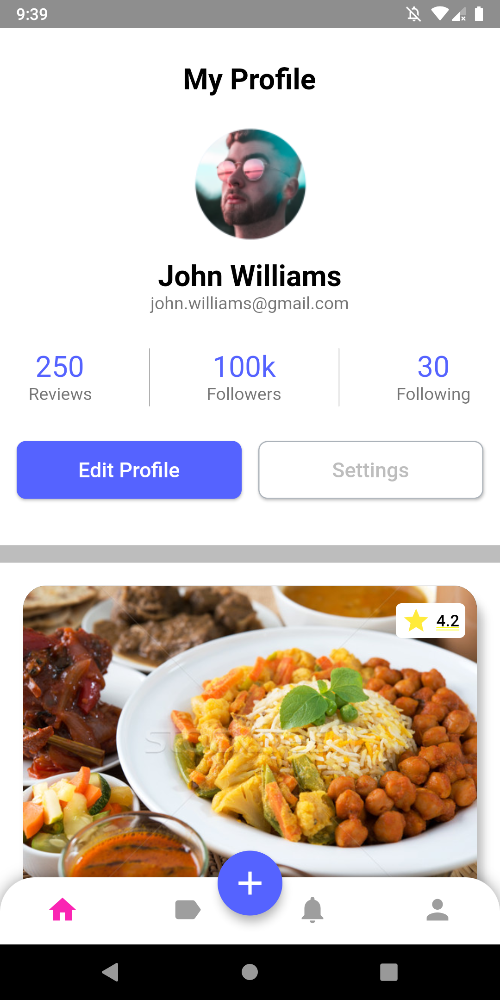

<h1><b>Design Ui Challenge 3</b></h1>

This UI desing was created using Flutter and public assets.
It was proposed in discord channel [Crazy about Flutter and Dart] (https://discord.gg/KkY42c7AGV)

Final Result.

## Getting Started

Just git clone and update the proyect with flutter pub get
